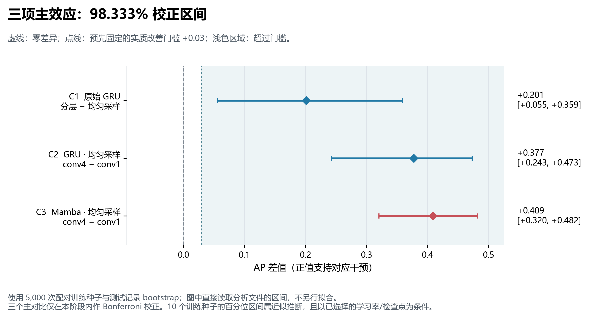

# 稀疏事件、记忆跨度与 GRU / Mamba

本仓库保存 2026-10-09 完成的时序模型机制研究：从初始假设出发，分析失败和反向结果，再冻结新干预，在新测试数据上复验。共完成 **430 次正式训练、152 次验证集调参训练，总计 582 次**。

## 主要结论

在本次受控的稀疏、短记忆任务中，**正例训练采样和局部时间卷积都能显著改变固定预算下的学习表现**。三项预定主比较使用每条件 10 个随机种子、5,000 次配对 bootstrap；98.333% 区间用于本阶段三项比较的多重比较调整，三项区间下界均超过事先设定的 3 个 AP 百分点门槛。

| 干预 | AP 提升（百分点） | 98.333% 区间 |
|---|---:|---:|
| GRU：均匀采样 → 正负平衡采样 | +20.10 | [5.52, 35.93] |
| GRU：局部卷积核 1 → 4，均匀采样 | +37.75 | [24.26, 47.29] |
| Mamba：局部卷积核 1 → 4，均匀采样 | +40.90 | [32.02, 48.23] |

保持相同的 4,096 条训练记录和 400 次更新，平衡采样后的原始 GRU 在 10/10 个种子中 AP 超过 0.9993；打乱必要线索后，查询内 AP 降至约 0.492。平衡采样重复使用已有阳性，并未增加独立标注数据。局部卷积比较保留共同形状参数的配对初始化和相同非线性，参数规模近似相同。



长记忆复验中，GRU 和 Mamba 都出现了真正使用 64 步前相关线索的成功模型。GRU 两种训练路径各 5/5 成功；Mamba 直接训练 2/5、渐进训练 4/5 成功，但渐进路径的主效应区间跨零，不能称为已确证的改善。早期长任务失败不能直接解释为架构没有记忆能力。

**证据边界：**这些强机制效应来自可控算法任务，不能当作物理接触仿真或真机闭环收益。另对 90 次真实触觉抓取、3 类物体做了离线滑移检测验证，未建立总体 GRU 优势。原 H1–H3 未得到整体支持；负结果、失败种子、标签来源限制和全部修订过程均保留。AP 使用 `average_precision_score`，并非 Accuracy。各阶段的统计调整不代表覆盖整个自适应研究的全局调整。

## 阅读入口

- [完整实验报告](experiment/outputs/实验结论.md)：研究过程、全部结果、原假设检验、真实数据与适用范围。
- [数据与复现说明](experiment/README.md)：环境、来源、许可、命令、指标定义及重新训练方法。
- [结果总表](experiment/outputs/结果总表.csv)：76 个模型与条件组合的汇总。
- [完整性核查](experiment/outputs/完整性核查.json)：五阶段训练计数、协议和来源哈希核对。
- [原始协议](experiment/outputs/实验协议.md)、[单状态补充协议](experiment/outputs/补充协议_单状态记忆.md)、[采样与局部卷积协议](experiment/outputs/补充协议_采样与局部卷积.md)、[记忆训练路径协议](experiment/outputs/补充协议_记忆训练路径.md)。
- [真实标签来源补充审计](experiment/outputs/标签来源补充审计.md)：标注来源的已知事实及未核实事项。

## 档案结构

```text
experiment/
  README.md                 数据与复现说明
  requirements.txt          已核实依赖版本（PyTorch 构建单独选择）
  manifest.json             4,475 个文件的大小与 SHA-256
  SHA256SUMS.txt             内容及 manifest 校验和
  outputs/                  中文报告、协议、CSV、12 张 PNG 及矢量 PDF
  work/
    experiment/             模型、训练、统计、绘图与核查代码
    results/                五阶段调参/训练结果、权重、预测和分析
    real_data/              逐试验处理数据、划分、审计、来源和许可
    frozen/                 初始冻结协议和源代码
    references/             固定版本的 Mamba 参考源码及许可
```

`experiment/` 是已校验的完整快照，内部路径保持原样。在仓库根目录运行以下只读校验：

```powershell
cd experiment
python work/package_results.py --verify
```

训练和分析命令见[复现说明](experiment/README.md)。完整重训应建立新的工作副本，保留当前已交付的结果；相同参数量和更新次数不等于相同 FLOPs、墙钟时间或充分收敛。

## 数据与许可

真实数据采用 [ARQ-CRISP / slip_detection_dataset_2021](https://github.com/ARQ-CRISP/slip_detection_dataset_2021/tree/a536ee3301af0566218782b00de334b6a6630979)，保留其 [BSD-3-Clause 许可](experiment/work/real_data/sources/arq2021_LICENSE)。档案包含处理后的数据，不重复保存约 266 MB 的原始 HDF5；下载脚本和固定 SHA-256 可用于重新获取和验证。

Mamba 参考实现固定到 `e9594ce1c732d97440f0332fdc43170a2294dbfa`，保留 [Apache-2.0 许可](experiment/work/references/mamba_LICENSE)。本地 Mamba 使用未融合的便携扫描实现，其运行时间不能作为优化后架构速度的公平结论。其他第三方来源、版本和边界见[复现说明](experiment/README.md)。

仓库当前内容仅保留本次研究。此前的学习路线、笔记模板和旧首页已从当前版本移除，Git 提交历史仍可追溯。
