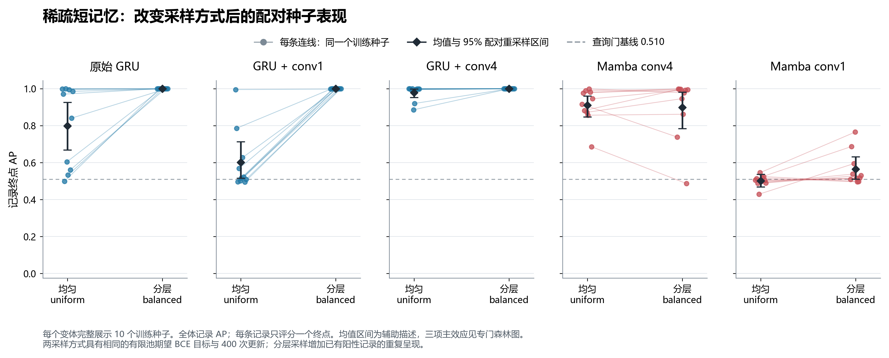
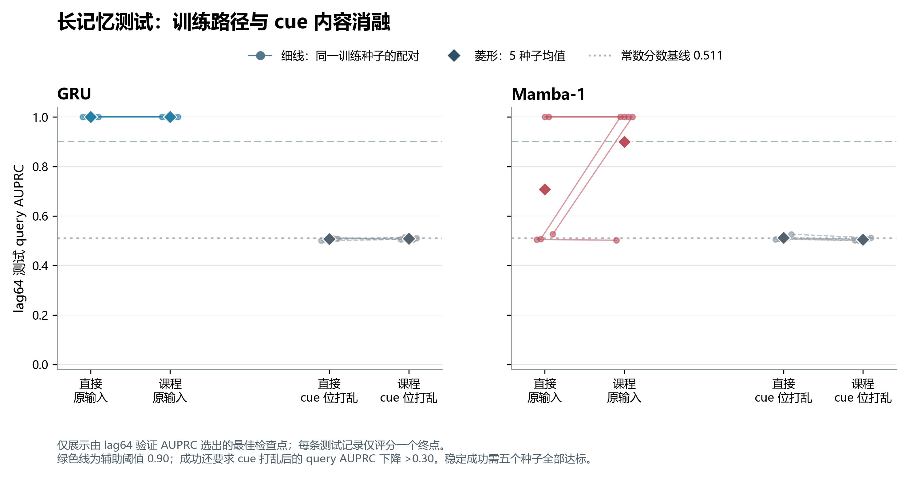

# 稀疏事件、记忆跨度与 GRU / Mamba：实验结论

实验启动日期：2026-10-09。全部计划内训练、调参和测试结果保留；五阶段包含看过旧结果后、在新测试数据上实施的两项机制干预。

## 结论

**已经得到强机制证据：在本次稀疏、短记忆任务中，训练采样和局部时间卷积都能造成大幅、可重复的性能变化。不能把这些差异仅归结为 GRU“简单”或 Mamba“擅长长序列”。** 三个新阶段预定主对比均通过98.333%配对区间及AP提升0.03的门槛，使用新的测试数据、十个训练种子、完整负结果和线索消融。

**第一，在本次十种子实验中，原始GRU的学习失败被训练采样干预消除。** 相同4096条标签、相同400次更新，AP从0.798785升至0.999821，提升20.10个百分点，校正区间[5.52,35.93]。分层方案10/10种子AP均超过0.9993；平均AP的辅助95%下界为0.99947。它没有增加独立阳性标签，只改变已有阳性的训练呈现。打乱必要线索后，query AP从约1降至0.492，支持模型确实学会了相关历史信息，而非只识别查询门。

**第二，局部时间卷积是这个短任务中的重要机制。** 在均匀采样和家族内相同学习率下，将conv1换为conv4，GRU增加37.75个AP百分点，校正区间[24.26,47.29]；Mamba增加40.90点，区间[32.02,48.23]。这一干预保留公共参数初始化和SiLU，参数规模近似相同。结论针对具体局部参数化及优化预算，不能扩展成所有卷积或所有Mamba的能力定律。

**模型选择应先控制“学没学会”和局部信息覆盖，再讨论长记忆架构。** 新任务的平均GRU/Mamba排名随采样改变，但均匀采样下架构差距的辅助区间跨零，不能写成“两侧都显著的排名反转”。分层采样没有普遍救活Mamba，仍有失败种子。原H1的笼统版本没有得到支持，H2/H3也不能由这些短任务结果代替检验。

**第三，长记忆失败不能直接解释为模型没有记忆能力。** 在最终64步依赖、每条记录只需保持一位信息的新任务中，GRU的直接训练和渐进训练均为5/5种子达标，query AP均为1.000；打乱必要线索后降至约0.507。Mamba也存在真正成功的长记忆运行：直接训练2/5达标，渐进训练4/5达标。这直接排除了“这些具体架构必然无法保持64步信息”的解释。Mamba的渐进路径平均提高19.28个query AP百分点，但97.5%区间为[-0.38,40.03]，不能把课程训练改善称为已经强证实。两条路径的结果、全部失败种子和训练曲线均保留。5/5成功及有限测试上的满分不意味着总体成功率必为100%；新旧任务之间同时改变了多项条件，也不能把跨阶段改善单独归因于增加训练步数。

这些强证据来自可控算法任务。另做的90次真实触觉抓取验证没有建立稳定的总体GRU优势，也没有真机闭环证据。研究上可据此推进“有效正例训练呈现＋局部触觉前端＋可验证的状态保持”这一具体方向；不能把合成任务的高分写成已证实的抓取恢复收益。

完成了 **430 次正式训练 + 152 次验证集调参训练，共 582 次**：初始机制实验160+64次，单状态补充80+32次，真实触觉70+28次，采样/卷积干预100+20次，长记忆训练路径20+8次。采样/卷积干预每条件10个种子，其余每条件5个。初始主比较参数量差异低于2%；新增五变体为19041–19449参数，最大差约2.14%。对比配对数据与训练随机种子；同架构采样对照共享完整初始权重，卷积变体共享同形公共参数。具体操控的训练采样或输入跨度按下文说明。验证集选择学习率、checkpoint和阈值，测试集不参与选择。

本报告中的 AP 指 `sklearn.average_precision_score`，不是 Accuracy，也不是梯形积分 PR-AUC。0.05 的 AP 差值等于 5 个 AP 百分点。

## 新机制证据 A：稀疏短记忆的采样与局部卷积

保持4096条训练记录、400次更新、每批32条、约1%阳性、2步必要记忆。新验证8192条，新测试65536条、671个阳性、1316次查询；十个训练种子。每架构家族所有变体/采样共用验证选出的学习率；家族内主对比不会同时改变学习率。

|模型|均匀抽样 AP|分层抽样 AP|均匀 AP≥0.90|分层 AP≥0.90|
|---|---|---|---|---|
|GRU|0.799|1.000|5/10|10/10|
|GRU + conv1|0.602|1.000|1/10|10/10|
|GRU + conv4|0.979|1.000|9/10|10/10|
|Mamba conv4|0.910|0.899|6/10|7/10|
|Mamba conv1|0.501|0.565|0/10|0/10|

|主对比|AP百分点|98.333%配对区间|下界>3百分点|
|---|---|---|---|
|GRU balanced - GRU uniform|+20.10|[+5.52, +35.93]|是|
|GRU conv4 uniform - GRU conv1 uniform|+37.75|[+24.26, +47.29]|是|
|Mamba conv4 uniform - Mamba conv1 uniform|+40.90|[+32.02, +48.23]|是|

三个主对比使用5000次共同种子与独立测试记录配对bootstrap，98.333%区间，预定实质差值3个百分点；校正范围仅为本阶段三项主AP对比。分层采样与均匀加权BCE具有相同有限训练池的期望风险，但不是相同Adam轨迹。分层每次运行重复呈现6400次已有阳性；均匀方案以实际记录中的阳性比例呈现，完整次数与空阳性批次均保留。训练池仅32–49个不同阳性，因此不可说成额外获得6400份阳性数据。

该改善衡量给定更新预算内的训练效率，不等于证明在两者都充分收敛之后，某模型需要的独立标签数量更少；同更新数也不代表同FLOPs或同实际耗时。

conv1与conv4均保留SiLU及公共参数初始化，控制额外非线性；不同核形状保留相应fan-in初始化。该干预识别的是给定预算中的局部参数化作用，并非脱离优化的一般表达容量定理。原始GRU与conv1还存在额外非线性/仿射层差异，两者差距不能全部归因于时间范围。

模型使用历史线索与否由只打乱被标记比特的消融检查；查询门始终保留，查询内参照约0.510，不能拿总体阳性率0.010作为唯一参照。循环移位干预固定，辅助消融区间以该固定干预为条件。

## 新机制证据 B：长记忆的训练路径

固定每记录一个相关位、最终64步依赖、4096条训练记录、2400次更新。direct始终训练lag64；curriculum每400次依次训练lag2/4/8/16/32/64。模型和AdamW均连续、不会在阶段间重置；同一模型的两路径共用学习率、标签池、初始化、抽样索引、总阳性呈现次数，验证始终lag64。

|模型|训练路径|全记录 AP|查询内 AP|打乱线索后查询 AP|达标种子|
|---|---|---|---|---|---|
|GRU|direct|1.000|1.000|0.507|5/5|
|GRU|curriculum|1.000|1.000|0.508|5/5|
|MAMBA|direct|0.708|0.708|0.512|2/5|
|MAMBA|curriculum|0.900|0.900|0.505|4/5|

|模型：渐进−直接|query AP百分点|97.5%配对区间|
|---|---|---|
|GRU|+0.00|[+0.00, +0.00]|
|MAMBA|+19.28|[-0.38, +40.03]|

测试16384条独立新记录、6561次查询。每模型的路径query AP对比为主指标，5000次配对bootstrap，两项比较各97.5%区间；原始AP、模型间排名及交互为描述性。预定单次达标为query AP>0.90且打乱线索下降>0.30；只有5/5达标才称跨这五个种子稳定成功。

渐进路径只有最后400次更新使用lag64，direct有2400次，因此不能称为相同长任务分布暴露。这里比较的是相同标签和总训练预算下的学习路径。测试使用验证最佳检查点；最终权重、优化器和全部24点验证曲线保留，最终验证分数不冒充最终检查点的测试分数。

以下保留此前所有证据和原假设检验，包括不支持或反向结果。

## 1. 原假设与事前判定标准

H1：1% 阳性、短记忆、小训练集下 GRU−Mamba > 0.03；H2：增加记忆跨度后，Mamba 的相对收益平均超过 0.03；H3：稀疏度、跨度、数据量的三重差分不为零。H1/H2 的“强支持”需要相应置信界超过 3 个百分点，只有点估计超过不算通过。

初始两套机制实验使用共同种子与共同完整测试记录的配对bootstrap，1000次重采样。三个主AP对比使用98.333%区间，对应套内Bonferroni调整；查询条件指标及真实数据比较使用描述性95%区间。5个训练重复和有限测试记录只能给出近似、条件性不确定性；区间不包含重新调参的不确定性。没有逐帧假定独立的bootstrap。新机制阶段另用5000次，规则见前文；各阶段校正不能合称覆盖全部自适应研究的一次全局检验。

## 2. 固定延迟随机符号任务 v1

每条记录 128 步，预测后 64 步的 `query AND past_bit`。事件阳性占据被评分时间步的期望比例为 1% / 20%；依赖距离 2 / 64 步；训练记录 64 / 256；测试 512 个完整独立记录。下面均为五种子 AP 均值。

|名义阳性率|依赖步数|训练记录数|MLP|TCN|GRU|MAMBA|
|---|---|---|---|---|---|---|
|1%|2|64|0.473|0.992|0.998|0.948|
|1%|2|256|0.468|1.000|0.999|1.000|
|1%|64|64|0.511|0.452|0.500|0.486|
|1%|64|256|0.530|0.503|0.518|0.509|
|20%|2|64|0.504|1.000|1.000|1.000|
|20%|2|256|0.504|1.000|1.000|1.000|
|20%|64|64|0.505|0.500|0.503|0.501|
|20%|64|256|0.509|0.504|0.502|0.503|

|假设|效应（AP百分点）|98.333%区间|预设支持门槛通过|
|---|---|---|---|
|H1|+4.97|[+0.64, +12.16]|否|
|H2|-1.29|[-5.51, +2.34]|否|
|H3|-4.82|[-13.21, +3.05]|否|

H1 的 GRU 优势约 4.97 个百分点，区间约 [0.64, 12.16] 个百分点：有方向性证据，但没有可靠超过事前的 3 个百分点门槛。H2、H3 的区间跨零。

长距离条件下，查询内 AP 接近无信息水平，打乱历史符号几乎不降低表现。因此“GRU 优势缩小”不能解释为“Mamba 学会了长记忆”。可见 query 门本身能产生约 0.5 的全时间线 AP，不能拿 1% 当作唯一无信息基线。完整 query-only、oracle 和 shuffle 指标已保存。

v1 长跨度还要求保留更多独立随机符号，增加了记忆容量负担；它是算法诊断，不是物理接触仿真。局部 TCN 的感受野固定为 31，不能用它在 64 步任务中的失败判断完整 TCN 家族的能力。

## 3. 固定一位相关信息的记忆任务 v2

每条记录只需保存一个由 cue 标记选中的相关位，改变 cue 到评分终点的距离。训练池 4096 / 16384 条，验证 2048 条，测试 16384 条；每条记录仅一个评分终点。这里 1% / 20% 是**评分终点阳性率**，不能称为完整连续流的时间占据比例。稀疏测试实际有 157 个阳性、345 次 query。

|名义阳性率|依赖步数|训练记录数|GRU|MAMBA|
|---|---|---|---|---|
|1%|2|4096|0.573|0.816|
|1%|2|16384|0.595|0.914|
|1%|64|4096|0.457|0.415|
|1%|64|16384|0.446|0.463|
|20%|2|4096|1.000|1.000|
|20%|2|16384|1.000|1.000|
|20%|64|4096|0.499|0.500|
|20%|64|16384|0.494|0.497|

|假设|效应（AP百分点）|98.333%区间|预设支持门槛通过|
|---|---|---|---|
|H1|-24.30|[-43.96, -0.91]|否|
|H2|+29.36|[+7.89, +46.35]|否|
|H3|-1.94|[-36.95, +35.27]|否|

该任务应与v1分开解释。固定信息量后出现的排序变化说明，v1的局部优势不能直接跨任务及训练协议推广。Mamba本身带有4步局部因果卷积，足以覆盖2步依赖；短跨度优势不能归因于长记忆机制。这一阶段尚未拆开优化和局部结构，因而随后设计了前文的新机制干预A。

v2 使用 400 次更新、batch 32，合计 12800 次记录抽取；不等于把 16384 条训练池全部遍历一遍。稀疏验证集预计只有约 20 个阳性，模型/阈值选择的噪声较大；约 72.5% 的随机 minibatch 可能没有阳性。固定预算下未学会不代表架构表达能力上限。cue-shuffle 仅改变被标记符号，其余输入保持不变；对应诊断见全量 CSV。

透明记录：v2 具体设计在查看 GRU/Mamba 排名前提出，但正式文件冻结前已经查看部分 v1 目标模型结果。v2 未根据这些分数改变；它是有记录的机制补充，不是 v1 原始预注册的一部分。两个实验各自的检验校正不能合称一次覆盖全部分析的全局校正。两生成器复用了种子命名及基础符号随机流，虽然标签规则和评分数据不同，也不应称为完全独立随机来源的复验；各任务内部的训练、验证、测试种子则互相分开。

## 4. 真实触觉数据

采用 [ARQ-CRISP / uSkin 2021 官方数据](https://github.com/ARQ-CRISP/slip_detection_dataset_2021/tree/a536ee3301af0566218782b00de334b6a6630979)：90 次抓取、3 类物体、228521 原始帧，约 21.15 分钟，238 次原始标签滑移起始。三个原始文件共 266271772 字节，全部与固定版本 Git LFS SHA-256 一致。

**作者提供人工滑移标签；标注观察来源及时间精度未核实。** 因此不能称为已核实独立于触觉信号的物理真值。此前筹备协议中的更强表述由[标签来源补充审计](标签来源补充审计.md)更正。

原始约 180 Hz，按每 6 帧做因果末端均值，降至约 30 Hz。使用末端当前标签，未知类 6 及含未知标签的 bin 排除；保留 37881 个有效端点，阳性率 26.09%。原始 54 通道保持一致，归一化只用训练集。按完整试验划分后才切窗口，每个测试端点评分一次。该任务是**当前滑移检测**，没有验证提前预测或真机恢复成功率。

|真实测试条件|GRU AP|Mamba AP|GRU−Mamba（百分点）|描述性95%区间|
|---|---|---|---|---|
|新试验，18条训练|0.615|0.551|+6.35|[-3.74, +15.23]|
|新试验，54条训练|0.540|0.551|-1.08|[-12.79, +8.22]|
|新物体：焊锡卷|0.291|0.324|-3.37|[-12.34, +5.31]|
|新物体：刷子|0.312|0.311|+0.11|[-11.60, +11.93]|
|新物体：螺丝刀|0.509|0.446|+6.24|[+0.23, +13.16]|
|三个固定新物体等权平均|0.370|0.360|+0.99|[-4.16, +6.12]|

新试验的小数据条件方向偏向 GRU，但区间跨零；完整训练集差异接近零。留一物体测试中螺丝刀一折出现 GRU 优势，该区间为未经多重比较调整的描述性区间；三个固定物体的等权平均差异约 +0.99 个百分点，区间跨零。不能只取有利物体作总体结论，也不能用三个固定物体估计任意新物体总体。

### 检测及报警指标

|训练量|模型|AP|逐帧F1|Event-F1|事件召回|误报次数/分钟|非滑移报警时间占比|
|---|---|---|---|---|---|---|---|
|18|MLP|0.526|0.541|0.570|0.510|2.83|32.2%|
|18|TCN|0.551|0.574|0.565|0.535|3.69|54.8%|
|18|GRU|0.615|0.561|0.457|0.445|5.31|42.4%|
|18|MAMBA|0.551|0.566|0.557|0.490|2.78|54.2%|
|54|MLP|0.496|0.528|0.556|0.480|2.48|49.7%|
|54|TCN|0.567|0.570|0.630|0.610|3.34|40.3%|
|54|GRU|0.540|0.534|0.589|0.440|0.51|32.5%|
|54|MAMBA|0.551|0.593|0.620|0.580|2.93|43.9%|

Event-F1 采用真实/预测片段一对一重叠匹配。真实测试集上的持续报警基线 Event-F1 约 0.590，误报片段数约 0.758 次/分钟，但非滑移时的报警占比为 100%。这说明仅用重叠 Event-F1 或误报片段次数会掩盖长期乱报警，必须结合 AP、逐帧精度和报警时间占比。

检测延迟仅针对已匹配事件，提前就开始并持续至事件的报警会产生截断为零的延迟；原始人工标签时间误差又未知。因此报告保存已知起始/左删失事件、漏检率、有符号起始差和时间 IoU，但不把零延迟写成提前预测能力。完整统计见真实数据的逐种子、逐记录 CSV。

## 5. 结论的适用范围

- 物理接触仿真与真实触觉域的完整“稀疏度 × 必要记忆 × 数据量”操控未完成。两套生成器是算法任务；真实数据的必要记忆跨度没有被因果识别。
- [公开 FlexiTac](https://huggingface.co/datasets/Tna001/tactile_test_tube_pyflexitac) 的 64 episodes / 75041 帧及全部 10 个缓存 parquet schema 已重新核查，未发现独立接触、滑移或成功标签，因此没有把输入阈值伪装成事件真值。它没有承担本轮滑移效能验证。
- 没有收敛到最优模型的保证。初始/短任务400更新、长路径2400更新、两个候选学习率和固定小模型配置限定了结论；匹配参数量不等于相同架构能力、FLOPs或充分调参。
- 没有真机闭环，因此不能推断恢复成功率、抓取成功率或安全响应提升。
- 原[描述长度论文](https://arxiv.org/html/2509.22445v3)不直接给出 GRU 优于 Mamba 的经验保证；本轮研究假设属于独立扩展。

## 6. 实现核验与可复现产物

环境为 Windows、RTX 5060 Laptop 8GB、PyTorch 2.11.0+cu128。主机制输入 8 维时，MLP / TCN / GRU / Mamba 参数分别为 19443 / 19111 / 19169 / 19449；真实输入 54 维时分别为 20915 / 20905 / 20641 / 21013。

Mamba-1 保留输入依赖 Δ/B/C、A/D、因果深度卷积、SiLU 门及官方初始化；官方来源固定到 `e9594ce1c732d97440f0332fdc43170a2294dbfa`。并行扫描与独立顺序参考的 float64 梯度最大误差约 1.78e−14；完整 mixer 与官方参考的 float32 梯度最大误差约 1.19e−7。所有最终配置通过因果性、形状和有限梯度检查。

本地 Mamba 扫描未使用官方融合 CUDA 核，O(L log L) 的便携实现与 cuDNN GRU 的延迟不能代表优化后架构速度对比。记录的训练时间包含验证开销，显存为当前实现的分配量。单独计时结果只作实现成本记录。

|模型|单个128帧窗口前向（ms）|前向额外峰值分配（MiB）|
|---|---|---|
|MLP|0.209|0.135|
|TCN|0.628|0.098|
|GRU|0.236|8.635|
|MAMBA|2.348|2.050|

计时输入为54维、batch1、128帧；GPU内输入，float32，10次预热，5组×20次CUDA事件计时的组中位数。它是整个窗口的前向耗时，既不是单步缓存流式延迟，也不是传感器至执行器的端到端延迟。显存列是该前向相对调用前的额外峰值分配，不是进程总占用；完整训练前向/反向与batch16记录另存JSON。

- [数据与复现说明](数据与复现说明.md)：来源、许可、原始文件哈希、完整执行命令。
- [原始实验协议](实验协议.md)与[单状态补充协议](补充协议_单状态记忆.md)：冻结配置与时序更正。
- [采样/局部卷积协议](补充协议_采样与局部卷积.md)、[记忆训练路径协议](补充协议_记忆训练路径.md)：基于旧结果重新设计、使用新测试集的可证伪干预。
- [结果总表](结果总表.csv)：所有条件与模型均值、种子波动和辅助指标。
- 完整复现实验目录（附中文 README）：源代码、处理数据、全部 checkpoint、预测、训练轨迹、调参记录、统计脚本及哈希清单。快照以其根目录为运行位置。
- `figures/`、`figures_adaptive/`、`figures_retention/`：中文PNG、矢量PDF、绘图源码和源数据；标准差与置信区间分别标注，不能混读。

本轮按“观察现象—提出具体解释—冻结新干预—用新测试数据检验”的顺序完成了重新设计。全部固定矩阵均跑完后统一分析，没有因中途结果有利而提前终止种子，也没有删除反向或未达标结果。新结论限于已经操控的机制；真实触觉闭环仍需另行实验。
